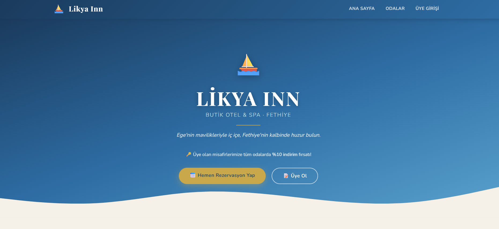
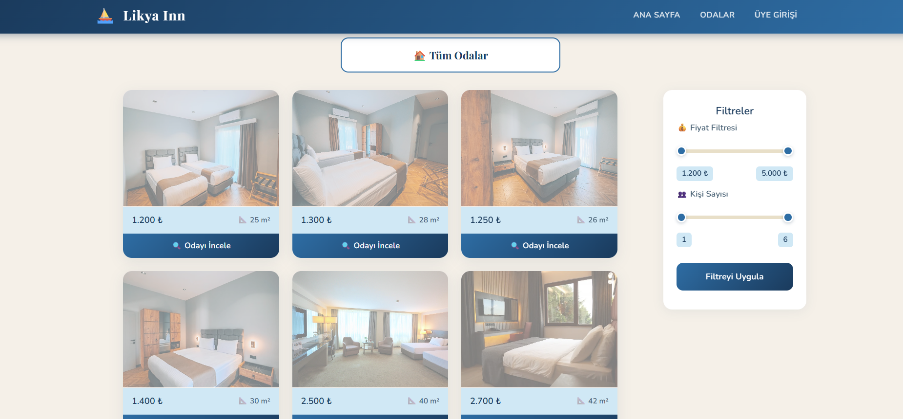
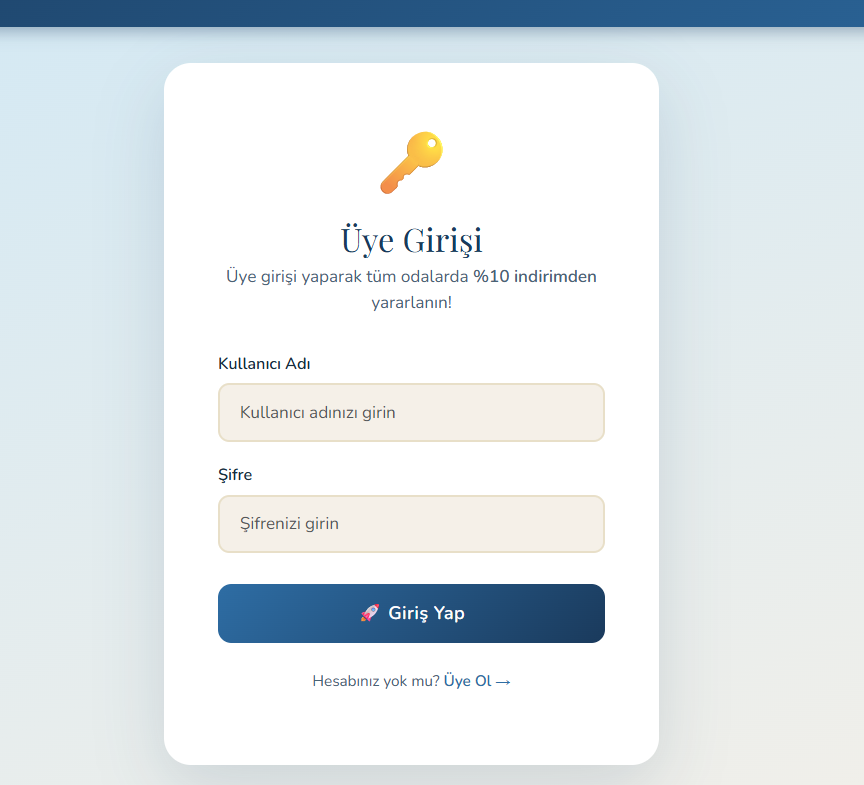
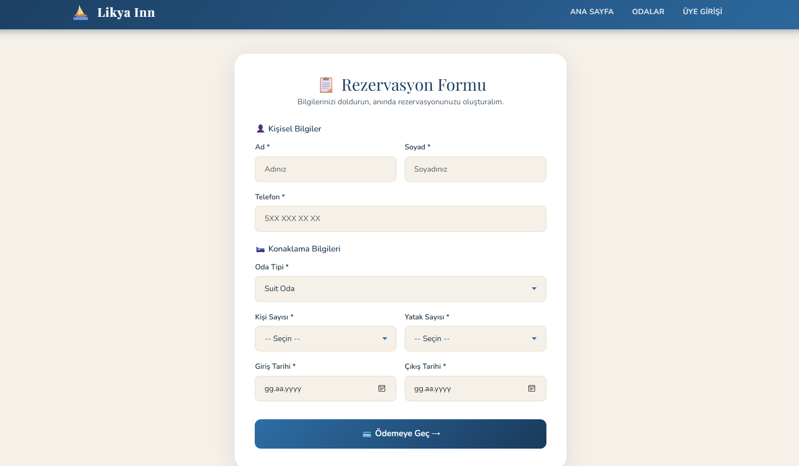
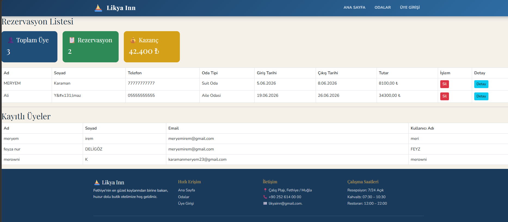

# LikyaInn Hotel Management System

 ## Proje Hakkında

LikyaInn Hotel Management System, ASP.NET MVC, Entity Framework ve SQL Server kullanılarak geliştirilmiş bir otel yönetim ve rezervasyon sistemidir.

Proje kapsamında kullanıcıların otel odalarını görüntüleyebilmesi ve rezervasyon oluşturabilmesi, yöneticilerin ise oda, müşteri ve rezervasyon bilgilerini yönetebilmesi amaçlanmıştır. Veritabanı işlemleri Entity Framework kullanılarak gerçekleştirilmiştir. ASP.NET MVC, Entity Framework ve SQL Server kullanılarak geliştirilmiş otel yönetim ve rezervasyon sistemi.

 ## Kullanılan Teknolojiler

- ASP.NET MVC
- C#
- Entity Framework
- SQL Server
- HTML5
- CSS3
- Bootstrap
- JavaScript

## Proje Özellikleri

- Otel ve oda yönetimi
- Oda listeleme
- Rezervasyon oluşturma
- Müşteri bilgilerini yönetme
- CRUD (Oluşturma, Okuma, Güncelleme ve Silme) işlemleri
- SQL Server veritabanı entegrasyonu
- Kullanıcı dostu arayüz

 ## Kurulum

1. Projeyi bilgisayarınıza indirin veya klonlayın.
2. SQL Server üzerinde gerekli veritabanını oluşturun.
3. `appsettings.json` dosyasındaki bağlantı bilgilerini kendi SQL Server ayarlarınıza göre düzenleyin.
4. Gerekli migration işlemlerini uygulayın.
5. Projeyi Visual Studio üzerinden çalıştırın.

## Ekran Görüntüleri

### Ana Sayfa

### Odalar

### Üye Girişi

### Rezervasyon Formu

### Admin Paneli

 ## Geliştirici

Meryem Karaman

Yazılım Mühendisliği Öğrencisi
